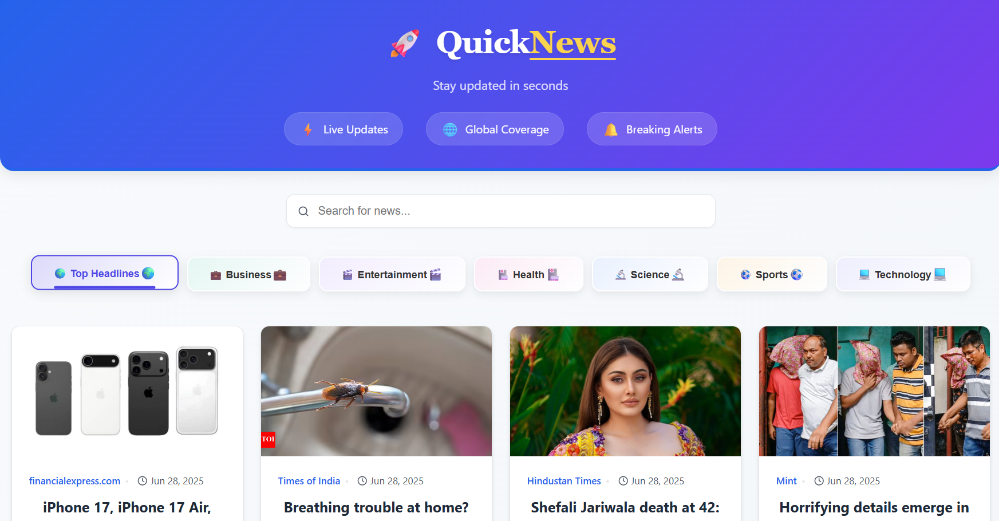

# 🚀 QuickNews - Modern News Aggregator

[](https://app.netlify.com/projects/quicknewsapi/deploys)
QuickNews is a modern, responsive news aggregator that delivers the latest headlines from around the world. Built with React and powered by the GNews API, it offers a clean, user-friendly interface for staying informed.



## ✨ Features

- 🌍 **Global News Coverage** - Get the latest headlines from various categories
- ⚡ **Lightning Fast** - Optimized for performance with React's latest features
- 🎨 **Modern UI** - Clean, responsive design with smooth animations
- 🔍 **Smart Search** - Find news on any topic instantly
- 📱 **Fully Responsive** - Works perfectly on all devices
- 🎨 **Dark/Light Mode** - Easy on the eyes in any lighting

## 🚀 Live Demo

Check out the live demo: [QuickNews Live Demo](https://your-netlify-app-url.netlify.app/)

## 🛠️ Tech Stack

- **Frontend**: React 18, React Hooks, Context API
- **Styling**: CSS3, CSS Variables, Flexbox/Grid
- **API**: GNews API
- **Build Tool**: Vite
- **Deployment**: Netlify

## 📦 Prerequisites

- Node.js (v16 or higher)
- npm (v8 or higher) or Yarn
- GNews API key (get one from [GNews](https://gnews.io/))

## 🚀 Getting Started

1. **Clone the repository**
   ```bash
   git clone https://github.com/your-username/quicknews.git
   cd quicknews
   ```

2. **Install dependencies**
   ```bash
   npm install
   # or
   yarn
   ```

3. **Set up environment variables**
   Create a `.env` file in the root directory and add your GNews API key:
   ```
   VITE_GNEWS_API_KEY=your_api_key_here
   ```

4. **Start the development server**
   ```bash
   npm run dev
   # or
   yarn dev
   ```

5. **Open in browser**
   The app will be running at `http://localhost:5173`

## 🛠️ Project Structure

```
src/
├── components/         # Reusable components
│   ├── NewsList.js     # Main news listing component
│   └── NewsArticle.js  # Individual news article component
├── App.js             # Main application component
└── main.jsx           # Application entry point
```

## 🤝 Contributing

Contributions are welcome! Please follow these steps:

1. Fork the repository
2. Create your feature branch (`git checkout -b feature/AmazingFeature`)
3. Commit your changes (`git commit -m 'Add some AmazingFeature'`)
4. Push to the branch (`git push origin feature/AmazingFeature`)
5. Open a Pull Request

## 📝 License

This project is licensed under the MIT License - see the [LICENSE](LICENSE) file for details.

## 🙏 Acknowledgments

- GNews API for providing news data
- React community for amazing documentation and support
- All contributors who helped improve this project

---

Made with ❤️ by [Your Name] | [](https://twitter.com/yourhandle)
